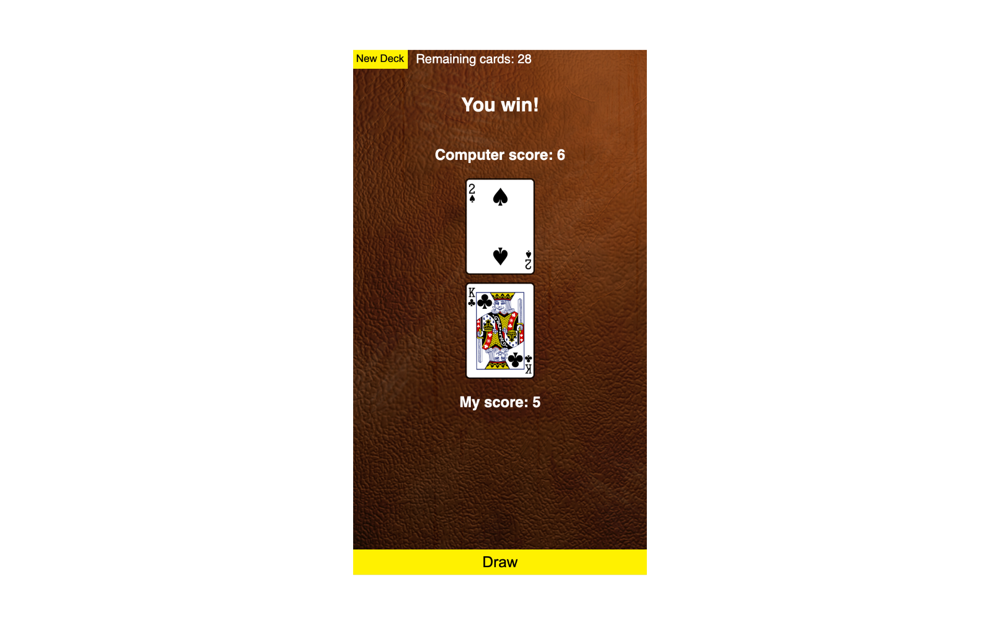
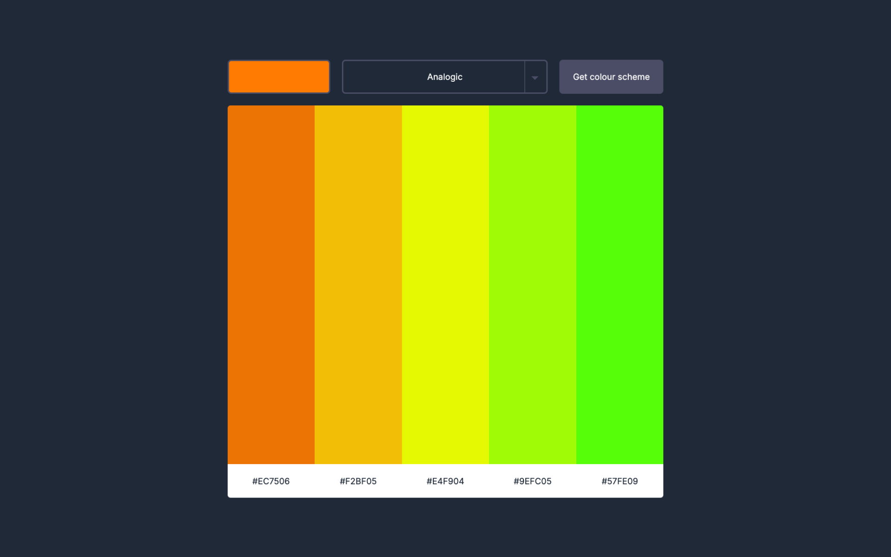
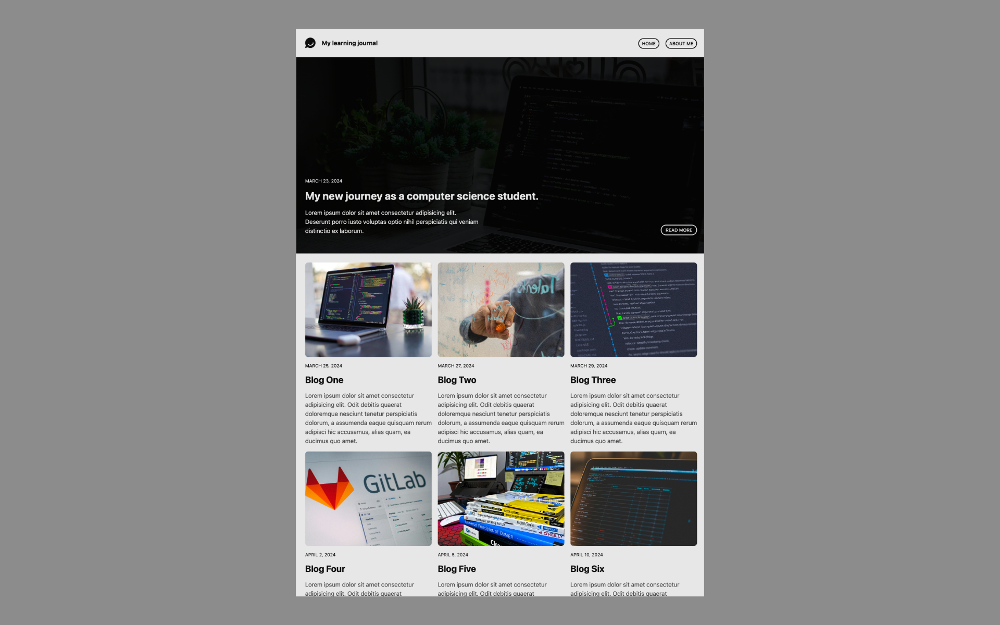
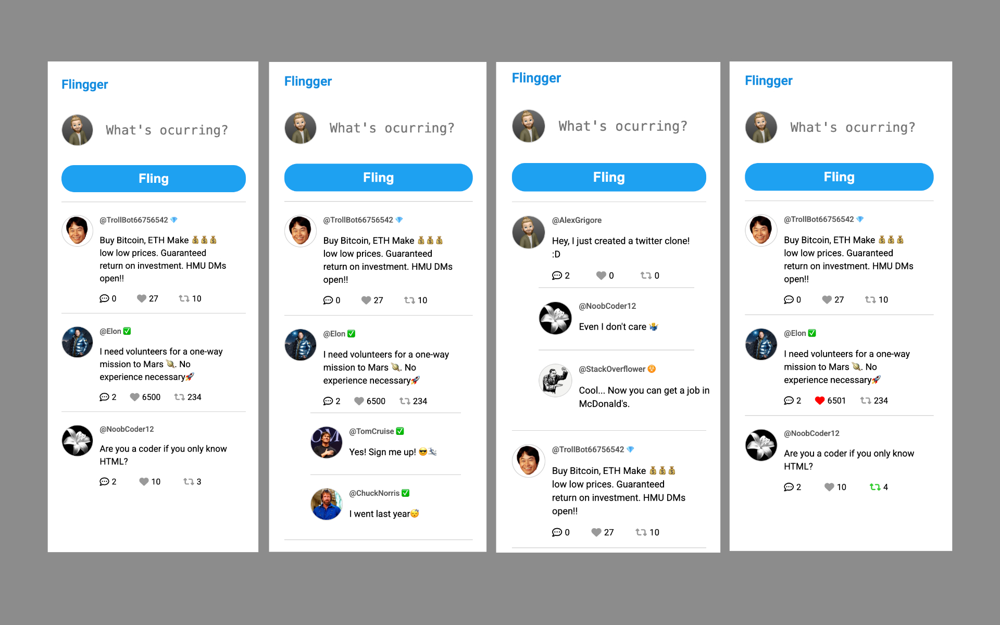
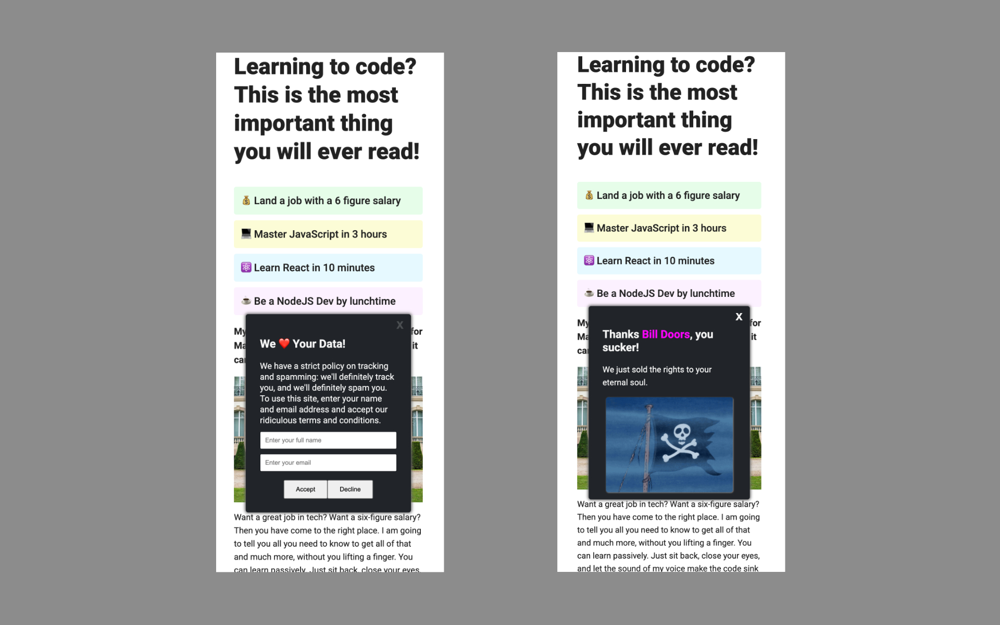
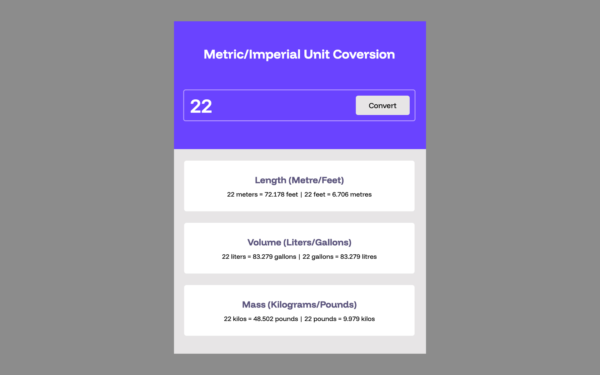
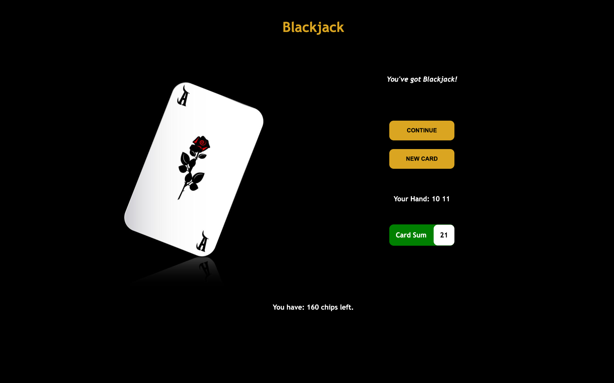

# Scrimba Notes & Projects

The notes and projects I create while undertaking the Frontend Path at Scriba. More will be added as I progress through the course.

## Project 26

## Topics covered in this project:

### 1. Callbacks:

-   Functions as first-class objects
-   Built own .filter() method

### 2. Promises:

-   Learned about the three states (pending, fulfilled, rejected)
-   .then() and promise chaining

### 3. War:

-   Deck of Cards API
-   Styling & Layout
-   Algorithm practice
-   UX Improvements

### 4. Async/Await

[To see the project code click here](https://github.com/agworkgit/scrimba/tree/main/26_war_game) 
[To see the project in action click here](https://agwargame.netlify.app/)

## Project 25

A fully responsive colour picker:

-   Select basis colour.
-   Select colour scheme.
-   The app will make an API call to return a colour pelette from colourAPI.

[To see the project code click here](https://github.com/agworkgit/scrimba/tree/main/25_colour_picker) 
[To see the project in action click here](https://agcolourpicker.netlify.app/)

## Project 21

A fully responsive journal website with multiple pages:

-   Navigate between pages.
-   Layout will shift based on the device viewing the website.

[To see the project code click here](https://github.com/agworkgit/scrimba/tree/main/21_learning_journal) 
[To see the project in action click here](https://aglearnjournal.netlify.app/)

## Project 18

A restaurant menu ordering app with the following features:

-   Add/remove items from the cart.
-   Show a total sum of all products in the cart.
-   Modal to process payment.

[To see the project code click here](https://github.com/agworkgit/scrimba/tree/main/18_ordering_app) 
[To see the project in action click here](https://agscrimba-ordering.netlify.app)

## Project 17

Flingger, a tweeting app with the following features:

-   Tweet some text.
-   Like a tweet.
-   Re-tweet.
-   View comments.

[To see the project code click here](https://github.com/agworkgit/scrimba/tree/main/17_flingger) 
[To see the project in action click here](https://flingger.netlify.app)

## Project 16

World's most annoying cookie consent with the following features:

-   Won't allow you to decline.
-   The rest is a 'surprise'.

[To see the project code click here](https://github.com/agworkgit/scrimba/tree/main/16_annoying_cookie_consent) 
[To see the project in action click here](https://cookiehell-site.netlify.app)

## Project 11

A unit conversion utility app:

[To see the project code click here](https://github.com/agworkgit/scrimba/tree/main/11_unit_conversion) 
[To see the project in action click here](https://agunitconvert.netlify.app/)

## Project 8

A blackjack web based game:

[To see the project code click here](https://github.com/agworkgit/scrimba/tree/main/8_blackjack) 
[To see the project in action click here](https://agblackjack.netlify.app/)

## Project 2

A landing page for a space exploration company:

[To see the project code click here](https://github.com/agworkgit/scrimba/tree/main/2_space_exploration) 
[To see the project in action click here](https://spaceex-gif.netlify.app/)
