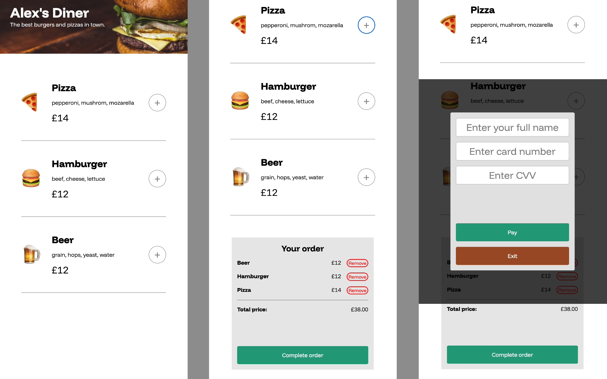

# Scrimba Notes & Projects

The notes and projects I create while undertaking the Frontend Path at Scriba.

## Project 18

A restaurant menu ordering app with the following features:

-   Add/remove items from the cart.
-   Show a total sum of all products in the cart.
-   Modal to process payment.

[To see the project code click here](https://github.com/agworkgit/scrimba/tree/main/18_ordering_app) 
[To see the project in action click here](https://agscrimba-ordering.netlify.app)

## Project 17

Flingger, a tweeting app with the following features:

-   Tweet some text.
-   Like a tweet.
-   Re-tweet.
-   View comments.

[To see the project code click here](https://github.com/agworkgit/scrimba/tree/main/17_flingger) 
[To see the project in action click here](https://flingger.netlify.app)
